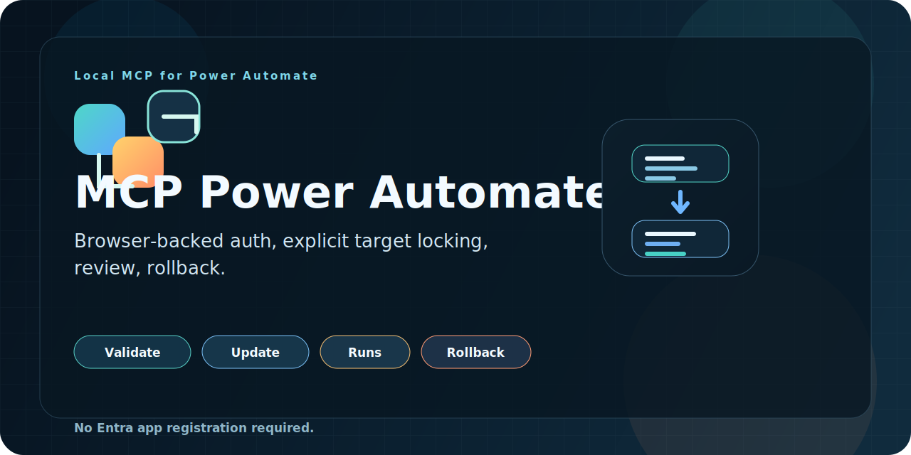

<p align="center">
  
</p>

# MCP Power Automate

Local MCP server plus a Chromium extension bridge for operating Power Automate flows through Codex.

This project lets a Codex agent:

- inspect the active flow in your browser
- validate and update flow definitions
- keep a one-step rollback history
- invoke request/manual flows
- inspect run history and action-level results

## What it is

The project has three pieces:

- `server/`
  Local MCP server plus an HTTP bridge on `127.0.0.1:17373`
- `extension/`
  Chromium unpacked extension that captures Power Automate browser context, session tokens, snapshots, and metadata
- `skills/power-automate-mcp/`
  Codex skill that teaches the agent how to use the MCP safely

## Current capabilities

- Read the active flow from the browser-backed session
- Validate the active flow
- Update the active flow
- Revert the last saved change
- List recent runs for the active flow
- Read run details and action statuses
- Wait for a run to complete
- Get a callback URL for a manual/request trigger
- Invoke a manual/request trigger with a test payload

## Current limitations

- The target flow is the flow currently active in the browser session captured by the extension
- The system depends on a logged-in Chromium session
- Rollback is currently one step only
- The extension popup shows summaries, not a full diff UI
- Production use is best done with supervision and change discipline

## Project layout

```text
mcp-power-automate/
|- extension/
|- server/
|- skills/
|  `- power-automate-mcp/
`- data/
```

## Install

```powershell
cd /path/to/mcp-power-automate
bun install
```

## Start the local bridge

```powershell
cd /path/to/mcp-power-automate
bun run start
```

The process provides:

- MCP over `stdio`
- local bridge over `http://127.0.0.1:17373`

## Load the browser extension

1. Open `chrome://extensions` or `edge://extensions`
2. Enable Developer Mode
3. Click `Load unpacked`
4. Select the `extension` folder in this repo

## Register the MCP in Codex CLI

You can register it with:

```powershell
codex mcp add power-automate-local -- node /path/to/mcp-power-automate/server/index.mjs
```

Then verify:

```powershell
codex mcp list
```

## Register the skill in Codex

Add this to `~/.codex/config.toml`:

```toml
[[skills.config]]
path = '/path/to/mcp-power-automate/skills/power-automate-mcp/SKILL.md'
enabled = true
```

This repo keeps the skill in the same repository as the MCP on purpose so the instructions and tools stay in sync.

## Available MCP tools

- `get_status`
- `get_health`
- `get_flow`
- `update_flow`
- `validate_flow`
- `get_last_update`
- `revert_last_update`
- `list_runs`
- `get_latest_run`
- `get_run`
- `get_run_actions`
- `wait_for_run`
- `get_last_run`
- `get_trigger_callback_url`
- `invoke_trigger`

## Available resources

- `power-automate://status`
- `power-automate://last-run`

## Typical workflow

1. Start the bridge
2. Open the target flow in Power Automate
3. Let the extension capture the active flow
4. Ask Codex to:
   - `get_flow`
   - `validate_flow`
   - `update_flow`
   - `list_runs` or `get_latest_run`
   - `invoke_trigger` for manual flows
5. Use the popup to:
   - refresh the current tab
   - refresh the latest run status
   - review the last update summary
   - revert the last saved change

## Recommended release posture

Good fit today:

- test flows
- staging flows
- supervised production changes
- iterative flow design with validation and rollback

Not yet ideal for fully unsupervised critical production automation:

- no multi-version rollback history
- no hard target-flow lock yet
- no full visual diff UI

## Skill

The included skill lives at:

```text
skills/power-automate-mcp/SKILL.md
```

It documents:

- safe edit workflow
- safe test workflow
- run inspection workflow
- rollback workflow
- practical limitations

## Repo instructions

See [`AGENTS.md`](AGENTS.md) for local repository guidance for agents and contributors.

## License

This project is licensed under the MIT License. See [`LICENSE`](LICENSE).
