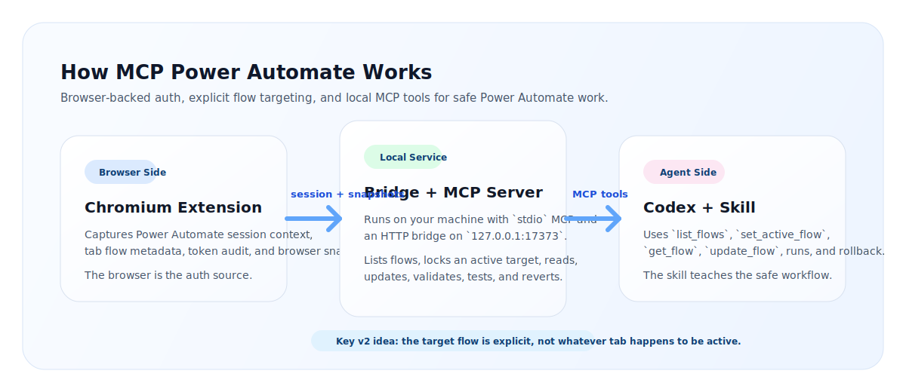

<p align="center">
  
</p>

# MCP Power Automate

<p align="center">
  <a href="https://github.com/kaael1/mcp-power-automate/stargazers"></a>
  <a href="https://www.npmjs.com/package/@kaael1/mcp-power-automate"></a>
  <a href="https://github.com/kaael1/mcp-power-automate/blob/main/LICENSE"></a>
  <a href="https://skills.sh/"></a>
  <a href="https://registry.modelcontextprotocol.io/v0/servers?search=io.github.kaael1/mcp-power-automate"></a>
</p>

Local MCP server, Chromium extension, and installable skill for operating Microsoft Power Automate flows through Codex.

This project lets an agent:

- list flows from the current environment, including owned and shared-visible flows
- select an explicit target flow instead of following the active tab
- read, validate, update, create, clone, test, inspect runs, and revert flows
- use the browser only for auth and visual context while the MCP owns the workflow logic

## Install in 60 seconds

Install the skill from GitHub:

```bash
npx skills add kaael1/mcp-power-automate --skill power-automate-mcp
```

Register the MCP locally:

```powershell
codex mcp add power-automate-local -- npx -y @kaael1/mcp-power-automate
```

Load the extension:

1. Open `chrome://extensions` or `edge://extensions`
2. Enable Developer Mode
3. Click `Load unpacked`
4. Select the `extension` folder in this repo

Open Power Automate, refresh any flow page, and ask Codex to:

1. `list_flows`
2. `set_active_flow`
3. `get_flow`

If this saves you time, star the repo:

- https://github.com/kaael1/mcp-power-automate

## Public package and registry links

- GitHub: https://github.com/kaael1/mcp-power-automate
- npm: https://www.npmjs.com/package/@kaael1/mcp-power-automate
- Official MCP Registry: https://registry.modelcontextprotocol.io/v0/servers?search=io.github.kaael1/mcp-power-automate
- skills.sh discovery: https://skills.sh/

## How it works

<p align="center">
  
</p>

The project has three pieces:

- `server/`
  Local MCP server plus an HTTP bridge on `127.0.0.1:17373`
- `extension/`
  Chromium extension that captures browser auth, tab flow context, token audit, and snapshots
- `skills/power-automate-mcp/`
  Skill instructions that teach the agent to work safely with explicit flow targeting

## Why this is local

This project is intentionally local-first.

- Your browser session remains the auth source
- The extension captures the environment and tab context you already trust
- The MCP runs on your machine and talks to Power Automate with your browser-backed session
- The selected target flow is explicit, so the agent does not blindly follow whichever tab is active

This gives you a good tradeoff:

- much more agent autonomy than manual clicking
- much less infrastructure and auth complexity than a remote SaaS MCP

## Current capabilities

- Read the selected target flow
- List flows from the current environment
- Merge `owned`, `shared-user`, and `portal-shared` flows into one catalog
- Lock the MCP onto an explicit active target flow
- Validate flows with legacy validation endpoints
- Update a flow and keep one-step rollback history
- Create a blank request or recurrence flow
- Clone an existing flow
- List runs, inspect action-level results, and wait for completion
- Get a callback URL and invoke manual/request flows

## Install options

### 1. Skill install from GitHub

```bash
npx skills add kaael1/mcp-power-automate --skill power-automate-mcp
```

You can verify discovery with:

```bash
npx skills add kaael1/mcp-power-automate --list
```

### 2. MCP install from npm

Use this in Codex-compatible config:

```json
{
  "mcpServers": {
    "power-automate-local": {
      "command": "npx",
      "args": ["-y", "@kaael1/mcp-power-automate"]
    }
  }
}
```

### 3. MCP install from local clone

```powershell
codex mcp add power-automate-local -- node /path/to/mcp-power-automate/server/index.mjs
```

## Typical workflow

1. Start the local bridge and MCP.
2. Open any flow in the target Power Automate environment.
3. Let the extension capture auth and environment context.
4. Ask Codex to `list_flows`.
5. Ask Codex to `set_active_flow` for the flow you actually want.
6. Continue with `get_flow`, `validate_flow`, `update_flow`, `list_runs`, `get_run`, `wait_for_run`, or `invoke_trigger`.

The popup helps you:

- compare the selected target flow with the current tab flow
- switch the selected target to the current tab
- refresh run status
- review the last update summary
- revert the last saved change

`list_flows` returns an `accessScope` hint per flow:

- `owned`
- `shared-user`
- `portal-shared`

## Available MCP tools

- `get_status`
- `get_health`
- `list_flows`
- `refresh_flows`
- `set_active_flow`
- `set_active_flow_from_tab`
- `get_active_flow`
- `get_flow`
- `update_flow`
- `create_flow`
- `clone_flow`
- `validate_flow`
- `get_last_update`
- `revert_last_update`
- `list_runs`
- `get_latest_run`
- `get_run`
- `get_run_actions`
- `wait_for_run`
- `get_last_run`
- `get_trigger_callback_url`
- `invoke_trigger`

## Available resources

- `power-automate://status`
- `power-automate://last-run`
- `power-automate://active-flow`

## Security model

This MCP is not a remote cloud service.

- It depends on a logged-in Chromium session
- It uses browser-backed tokens captured locally by the extension
- It is best suited for trusted local use
- It is strong enough for supervised real work, but still benefits from change discipline on production flows

## Current limitations

- The browser still provides auth and current-tab context
- Rollback is currently one step only
- The popup shows summaries, not a full diff UI
- The current architecture is local-first, not remote SaaS-style
- Critical production use is still best done with supervision

## Publishing

This repo is already prepared for:

- GitHub discovery
- `skills.sh` / Vercel-style skill installation
- npm distribution
- Official MCP Registry publishing

Relevant files:

- [`package.json`](package.json)
- [`server.json`](server.json)
- [`PUBLISHING.md`](PUBLISHING.md)

## Repo guidance

See [`AGENTS.md`](AGENTS.md) for local repository guidance for agents and contributors.

## License

MIT. See [`LICENSE`](LICENSE).
