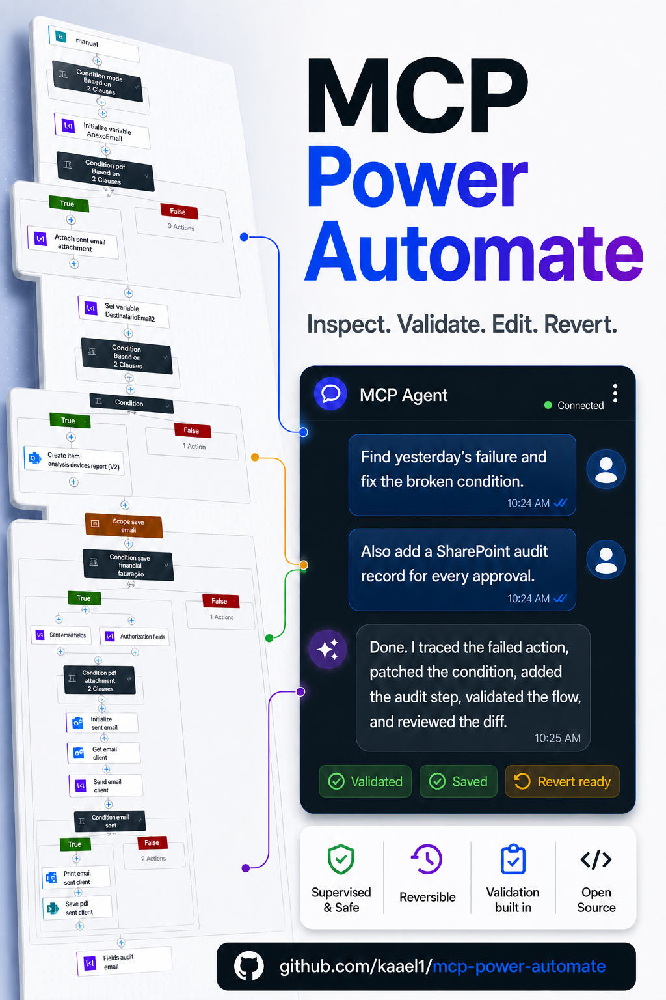

<p align="center">
  
</p>

# MCP Power Automate

Local-first MCP server and Chromium extension for AI-assisted Microsoft Power Automate work.

Use your existing logged-in browser session to let an MCP client inspect, validate, edit, run, review, and revert Power Automate cloud flows. No Microsoft Entra ID app registration, admin consent flow, or custom enterprise application setup is required to get started.

> Early public signal: 15,000+ LinkedIn post views and 14 GitHub stars while the project is still small, practical, and moving fast.

## Why It Exists

Power Automate is powerful, but AI agents need more than raw convenience before they should touch real flows. This project keeps the workflow visible and reversible:

- The browser extension captures the active Power Automate context and compatible tokens from your own Chromium session.
- The MCP server exposes a v1 command surface for targeting, reading, previewing, validating, saving, run inspection, and rollback.
- The extension stays mostly passive: status, diagnostics, and review surfaces instead of mystery buttons that hide what changed.
- Local state, snapshots, and backups stay on your machine.

## What It Can Do

| Area | Capabilities |
| --- | --- |
| Context | Detect browser-captured flows, list flows, and explicitly lock onto a target flow. |
| Safe editing | Read the flow, preview the smallest candidate update, validate, save, review the diff, and revert. |
| Debugging | Inspect recent runs, latest run details, and action-level failures. |
| Testing | Invoke safe manual/request trigger flows and wait for the resulting run. |
| Solutions | List unmanaged Dataverse solutions, inspect solution components and environment variables, add existing flows, and create blank flows inside solutions. |

Write operations are deliberately scoped. The MCP does not expose solution deletion, component deletion, managed-solution modification, environment-variable writes, or blind production edits as the default path.

## Quickstart

Register the MCP in Codex:

```powershell
codex mcp add power-automate-local -- npx -y @kaael1/mcp-power-automate
```

Find the packaged extension path:

```powershell
npx -y @kaael1/mcp-power-automate extension-path
```

Load that folder in Chromium:

1. Open `chrome://extensions` or `edge://extensions`.
2. Enable Developer Mode.
3. Choose `Load unpacked`.
4. Select the folder printed by `extension-path`.

Then open or focus a Power Automate flow page. The extension captures the session and target context automatically.

Check readiness:

```powershell
npx -y @kaael1/mcp-power-automate doctor
```

## Recommended Agent Loop

For a supervised edit, ask your MCP client to follow this loop:

1. `doctor`
2. `get_context`
3. `connect_flow`
4. `get_flow`
5. `preview_flow_update`
6. `validate_flow`
7. `apply_flow_update`
8. `get_last_update`
9. `validate_flow` again when available

For run inspection and manual/request trigger tests, use `list_runs`, `get_latest_run`, `get_run`, `get_run_actions`, `wait_for_run`, `get_trigger_callback_url`, and `invoke_trigger`.

For Dataverse solution work, use `list_solutions`, `list_solution_components`, `list_environment_variables`, `add_flow_to_solution`, and `create_flow_in_solution`. Solution writes are intentionally limited to adding cloud flows to unmanaged solutions.

## Public v1 Tools

```text
get_context
doctor
connect_flow
list_flows
list_solutions
list_solution_components
list_environment_variables
add_flow_to_solution
get_flow
preview_flow_update
validate_flow
apply_flow_update
get_last_update
revert_last_update
list_runs
get_latest_run
get_run
get_run_actions
wait_for_run
get_trigger_callback_url
invoke_trigger
create_flow
create_flow_in_solution
clone_flow
```

## Safety Model

- Inspect with `get_context`, `connect_flow`, and `get_flow` before any write.
- Preview with `preview_flow_update` before saving.
- Validate before and after meaningful edits when Power Automate accepts validation.
- Review `get_last_update` after save so the diff is visible.
- Use `revert_last_update` when the saved result is wrong.
- Prefer test or staging flows before production flows.

If Power Automate rejects a save because of a connection permission problem, the MCP reports `CONNECTION_AUTHORIZATION_FAILED` and waits for the user to fix that connection in Power Automate. If the service rejects a field such as `retryPolicy`, the MCP reports `SCHEMA_VALIDATION_FAILED` with the rejected member so the agent can correct the candidate flow instead of guessing.

## Browser-Backed Auth

The extension can capture Power Automate, Power Platform/BAP, and Dataverse-audience tokens from your logged-in browser session. When those tokens are present, `get_context` and `/health` expose readiness details such as `canManageSolutions`.

This means the MCP can work without a new Microsoft Entra app registration, but it also means the browser session remains the live authority. If a token expires or a permission is missing, reopen or focus the relevant Power Automate, Power Apps, or Dataverse page and retry after capture.

### Troubleshooting token capture

If the extension dashboard or `get_context` shows a connected browser session and an active flow, but `hasLegacyApi` remains `false`, deeper tools such as `list_flows`, `list_runs`, `validate_flow`, and `apply_flow_update` may report that no flow-compatible token is available.

One known cause is Power Automate's New designer. If refreshing or focusing the flow page does not capture a compatible token, turn off the New designer toggle for that flow and reopen the flow in the classic designer. The classic designer can expose the legacy flow-service requests that the extension needs to capture for validation, run inspection, and save operations.

After switching designers, refresh the flow page and run `doctor` or `get_context` again. The expected healthy state is a connected session with `hasLegacyApi: true`.

## HTTP Bridge

The local bridge listens on `127.0.0.1:17373`.

- `GET /health` is kept for simple probes.
- `GET /v1/health` returns bridge identity and readiness.
- `GET /v1/context` returns the same context used by the MCP.
- `GET /v1/commands` lists the public v1 command surface.
- `POST /v1/commands/:name` runs any public v1 command with a JSON body.

Only the process that owns the bridge port executes stateful work. If another process already owns the port, new MCP instances refuse to reuse it; stop the existing bridge process or choose a different `POWER_AUTOMATE_BRIDGE_PORT`.

## Development

```powershell
npm install
npm run typecheck
npm run lint
npm run test
npm run build
npm run pack:dry-run
```

For a local clone, prefer registering Codex against the built server from this checkout:

```powershell
npm run build
$nodePath = (Get-Command node).Source
$serverPath = Join-Path (Get-Location) "dist/server/index.js"
codex mcp add power-automate-local -- $nodePath $serverPath
```

If an older local entry exists, remove it first:

```powershell
codex mcp remove power-automate-local
```

Load the browser extension from `dist/extension` after rebuilding. Runtime state lives in `data/` and must not be committed.

## Docs

- [Launch kit](docs/launch-kit.md)
- [Multi-provider distribution](docs/multi-provider-distribution.md)
- [Publishing](PUBLISHING.md)
- [Codex skill bundle](skills/power-automate-mcp/README.md)

## Package Links

- GitHub: https://github.com/kaael1/mcp-power-automate
- npm: https://www.npmjs.com/package/@kaael1/mcp-power-automate
- MCP Registry: https://registry.modelcontextprotocol.io/v0/servers?search=io.github.kaael1/mcp-power-automate

## License

MIT. See [LICENSE](LICENSE).
